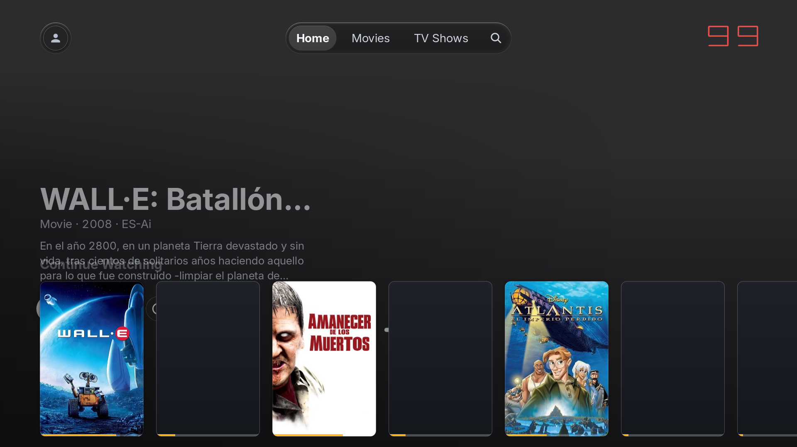
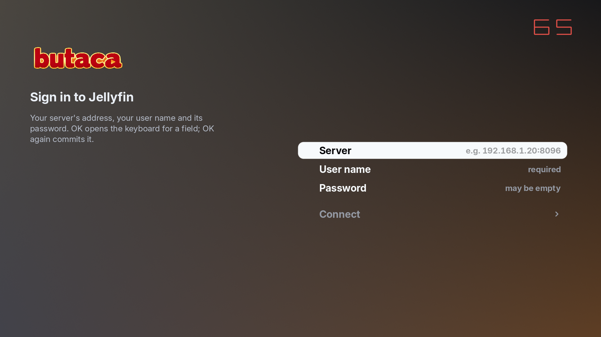
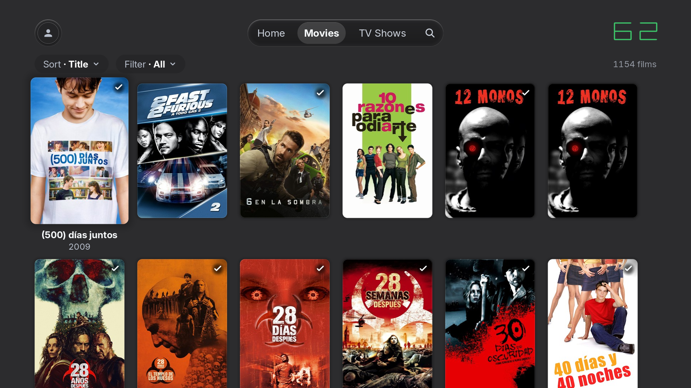

# Butaca

A native [Jellyfin](https://jellyfin.org/) client for LG webOS televisions. Not a web page: the
interface is drawn directly on the GPU at 60 fps, and the video is decoded by the TV's own
hardware.

An armchair to sit in and watch whatever is on your server.

## Why

It's about getting the most out of LG TVs that are not exactly new. Models running webOS 5.x and
earlier ship with a Chromium that is old and slow: the official web apps come up short exactly
where they shouldn't, and there's no way a browser reaches the stable 60 fps of a native
interface.

Butaca attacks that at the root: it throws the browser away, draws on the GPU, and hands the
video to the same silicon the built-in apps use. No Chromium, no JavaScript, no web view.

## Screenshots

All three were taken from the desktop simulator build, running against a real Jellyfin server;
on the television the same screens render through the TV's GPU at native 1080p.

| | |
|---|---|
|  |  |
| Sign-in: server, user, password | The library grid |

## What's done

Ported from [plx-native](https://github.com/GLinnik21/plx-native) and now tracking its v0.6.5
line, swapping the Plex backend for Jellyfin:

- Native (Rust) interface at 60 fps on the TV, with regression scenes that measure it on the
  actual television instead of just trusting it.
- On-screen Jellyfin login: URL, username and password, with no prior setup.
- Library browsing, detail, profiles and search wired to the Jellyfin API.
- Direct playback (H.264 / HEVC) through the TV's native video pipeline, plus seek-on-transcode
  resume support.
- Everything the upstream v0.6 line brought with it: the decoder race fix, the failure screens
  that name your set, the opt-in reporting with its consent flow, and redacted event logs.
- Custom identity: the name "Butaca", the icons and the on-screen text.

### Jellyfin server compatibility

Works against Jellyfin 10.x and 12.x servers. The client authenticates over the standard
`Authorization: MediaBrowser` header, which is what Jellyfin 12 requires (the legacy
`X-Emby-*` headers were removed server-side in 12), and media/stream/image URLs ride the
`api_key` parameter that both versions accept.

## Status

Not distributable just yet. The remaining work is tracked in the issues:

- [#1](https://github.com/gnacho/butaca/issues/1) - runtime UI translation engine and Spanish
- [#2](https://github.com/gnacho/butaca/issues/2) - first-run sign-in for new users and the
  stable installable package
- [#3](https://github.com/gnacho/butaca/issues/3) - route crash and error reports to our own
  collection backend
- [#4](https://github.com/gnacho/butaca/issues/4) - redesign the launcher icon set

Until #2 lands, there is no public .ipk to install: the repository is published so the work is
out in the open and the history is honest.

## Credits

This project is a fork of [plx-native](https://github.com/GLinnik21/plx-native), the native Plex
client for webOS by [Gleb Linnik](https://github.com/GLinnik21). The rendering engine, the host
layer and the video pipeline Butaca builds on are his, and the hours it must have taken him to
get there are obvious. We're deeply grateful, and this wouldn't exist without his work.

## License

[MIT](LICENSE). The original copyright belongs to Gleb Linnik (see LICENSE); Butaca's changes and
adaptations are published under the same terms. The "Butaca" name and the fork itself are not
affiliated with, endorsed or sponsored by Jellyfin, LG or Gleb Linnik.

**Unofficial client.** "Jellyfin", "LG" and "webOS" are trademarks of their respective owners;
where they appear, they identify the service or platform the app works with.
