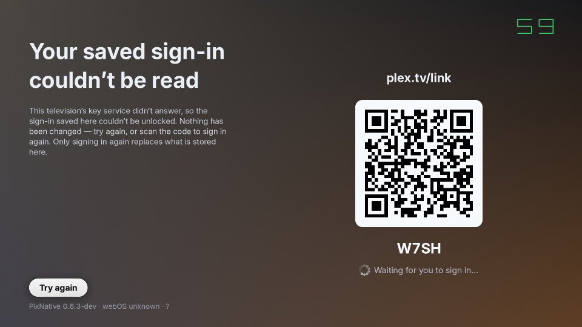
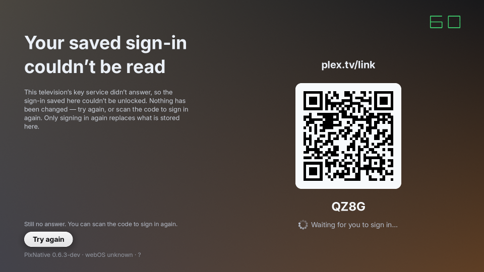
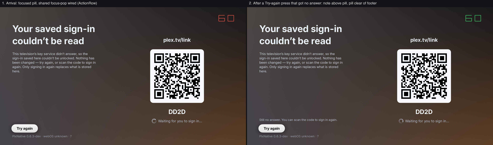

# A stalled key service over a sealed sign-in — simulator, 2026-09-10

What a television does when `com.webos.service.keymanager3` stops answering **after** it has already
sealed a session: the read-out it draws, what it leaves on disk, and where a service that never
comes back finally settles. Companion to
[`keymanager-fake-sim-matrix-2026-09-10.md`](keymanager-fake-sim-matrix-2026-09-10.md), which walks
each fake mode from a clean install; this one starts from the state that matrix's `healthy` rows end
in — a **real sealed envelope plus `secure-storage.proven`** — and then takes the service away.

`make sim` (macOS desktop simulator), not a device run. It answers file/process state and screen
layout, which is what the simulator can see; see `.claude/skills/ui-sim/SKILL.md` for what does not
transfer (this screen's text rasterization and the real LS2 budget among them).

## Setup

Instance root seeded with a signed-in session pointing at a placeholder server
(`192.0.2.10:32400`, TEST-NET-1 — no real address or token is in this repo), plus
`plxnative-noidle` (without it `sim-shot` never presents a frame on a screen that settles) and
`plxnative-keymanager=<mode>`:

```sh
D=/tmp/sim-km-unavailable
# auth.json: client_id + server{address=192.0.2.10,port=32400,token=<PLACEHOLDER>,
#            origin=http://192.0.2.10:32400} + user{...}
touch $D/plxnative-noidle
printf healthy > $D/plxnative-keymanager
make sim-shot SIM_DIR=$D SIM_PMS=192.0.2.10 SIM_SHOT=$D/launch1.png SIM_FRAME=120   # ×2
printf stall > $D/plxnative-keymanager                                              # the service goes quiet
make sim-shot SIM_DIR=$D SIM_PMS=192.0.2.10 SIM_SHOT=$D/launch3.png SIM_FRAME=120   # ×3
```

Each `sim-shot` is a **separate process** against the same instance root, which is the launch
boundary the whole mechanism turns on.

## Results

| launch | mode | log | `auth.json` | markers | screen |
|---|---|---|---|---|---|
| 1 | `healthy` | `keymanager: generateKey -> created`; `session: secure storage has not yet been proven on this install; keeping the 0600 file and probing` | plaintext | `secure-probe.json` planted | Home |
| 2 | `healthy` | `session protection: keymanager3` | **secure envelope** | probe reopened → `secure-storage.proven`; probe removed | Home |

Rows 1-2 were recorded on the branch as it stood that day, and **they reproduce today**: re-run
2026-09-11 on `consent/scope-versions-v0.6`, a plain `make sim` binary (`features=dev`,
`PLX_VERSION` `0.6.3-dev`), two `sim-shot` processes against one seeded instance root, both lines
byte-for-byte as printed above — launch 1 planting a 233-byte `secure-probe.json` beside a
plaintext `auth.json`, launch 2 leaving a `SecureEnvelope` on disk plus
`secure-storage.proven` = `{"identity":"anonymous","proven_at_version":"0.6.3-dev","stage":"probe_opened"}`
and no probe file. **The host configuration that reproduces them is any `make sim` with
`plxnative-keymanager` armed** — see the correction at the end of §"Reproducing the read-out
directly", which claimed the opposite.
| 3 | `stall` | `session: secure file is present but its device key is unavailable`; `session: the key service did not answer this launch; the sealed sign-in is left untouched`; `boot: no session — starting QR sign-in` | **byte-identical to launch 2** (`cmp` clean) | `secure-storage.unavailable` = `{"launches":1,"stage":"no_reply",…}`; **no `secure-storage.refused`** | the read-out below |
| 4 | `stall` | same three lines | byte-identical | `launches` → 2 | same read-out |
| 5 | `stall` | `session: the key service has not answered for this envelope across several launches — grading it a refusal` | byte-identical | `secure-storage.unavailable` removed; **`secure-storage.refused`** = `{"stage":"no_reply","reason":"envelope_unopenable",…}` | the ordinary QR screen — the read-out is gone |

Pressing the control (an `ok` token through `$SIM_DIR/plxnative-remote`, launch 3's state) logs
`keymanager: retry -> no_reply`, draws the second read-out below, and leaves `launches` at 1:
**one launch spends one of the three however many times the button is pressed.** That last claim is
`plex::session`'s own gate (`session.rs`'s "counts each launch once however many times the screen's
*Try again* re-asks"), not something this session demonstrated — **what was measured here is ONE
press.** A second press could not have shown anything on the build this run used: `ui::login`'s
`start_storage_retry` claimed the worker slot out of `RETRY_IDLE` alone, so once the first press had
failed the control was inert for the rest of the visit (review finding, fixed 2026-09-11 —
`claim_storage_retry` now claims from either settled state, pinned by
`a_press_after_a_failed_retry_asks_again`). Re-running the press half against a build carrying that
fix is what would turn the sentence into an observation.

## The screen



The narrative column is the read-out and the QR stack beside it is untouched — the two ways out, in
the order to try them. The pill is the only control on the route, so it holds focus by
construction, and it sits one caption line above the identification footer: **the first capture of
this screen had it printed straight through the version string**, since `RouteLayout::action`'s
bottom edge is the safe area's and every other user of that slot has nothing under it.
`login::storage_action_y` and `the_try_again_pill_clears_the_identification_footer` are the fix and
its gate.

After a press that got nowhere, one caption line appears above the pill — and it names the way in
that is still open rather than restating the failure, because a second dead end beside a working QR
code is a screen telling somebody they are stuck when they are not:



## What this run does and does not settle

- **Settled here**: the envelope survives a stalled service byte for byte across three launches; no
  refused marker is written on the way; the counter climbs per LAUNCH rather than per open; the
  escalation fires exactly at `UNAVAILABLE_MAX_LAUNCHES` and hands the install back to the ordinary
  refused path; the screen, its copy, its one control and its footer clearance.
- **Not reachable on the simulator**: a *successful* Try again. `dev::keymanager_fake_mode` is read
  once at boot, so a fake armed `stall` cannot start answering mid-launch — the press can only be
  observed failing. The success path is graded on the host instead, by
  `plex::session::tests::a_later_successful_open_in_the_same_process_publishes_the_session`
  (envelope opens on the second ask, session published, file rewritten by nothing), with
  `auth::resume_secure_session` carrying it into the boot gate's own destination.
- **A gap this run makes visible rather than closes**: the read-out draws over `Phase::Waiting`
  alone, so a television that has BOTH a stalled key service and no route to plex.tv lands on the
  sign-in flow's own `Couldn't sign in` read-out and is never told its saved sign-in is still
  there. Every other phase already owns its screen and its one control, so this is a decision about
  which read-out wins rather than a missing branch — but it is the case a household with a
  misbehaving television is most likely to hit, and nothing here answers it.
- **Not answered by any tier without a television**: whether a real keymanager3 that has gone quiet
  answers `no_reply` (its budget) or `unreachable` (a refused registration) on the affected sets,
  and how long a real press takes. Both are classified identically, so the behaviour does not turn
  on it; the number in the report does.

## Follow-up, 2026-09-10: four review findings on this screen

Four things a review of commits `6aaa6983`/`e68fc754` (the read-out and pill above) turned up, all
fixed in `ui/login.rs`/`auth.rs`:

1. **`settle_storage_retry` acted on a worker's result with no check that the flow it was about was
   still the one on screen.** A Try again press and a QR sign-in scanned on the phone race the
   SAME running attempt, and a normal completion of that attempt never bumps `Ctl::attempt` — only
   a fresh reset does — so the attempt id alone cannot see it. The fix
   (`storage_retry_still_applies`, gated on both the captured attempt AND `Phase::Waiting`) is a
   host-only fact and is pinned by
   `a_stale_storage_retry_result_is_dropped_once_a_newer_sign_in_has_won`, watched red against a
   simulated "always applies" defect before the real predicate went back in.
2. **The pill drew as a flat `Button` with no focus pop.** It now goes through the same
   `route_screen::ActionRow` every other route-family pill uses (`STORAGE_ACTION_POP`), so focus
   arriving on it grows it exactly as Settings' Retry/Done and first-run consent's answers do — see
   that static's own doc for what this reaches (the pop) and what it deliberately does not (the
   press DIP, which needs `app.rs`'s `key_onboarding` to arm `press::begin_ctl`/`release`, a file
   this fix's scope does not touch).
3. **The retry note's fixed one-line offset could run past the room the comment claimed it
   borrowed**, overprinting the body copy once the body filled its own allowance. The budget is now
   derived from what is actually left (`storage_note_room`, mirroring
   `RouteLayout::draw_narrative_with_note`'s own `room_lines`), pinned by
   `the_retry_note_budget_derives_from_the_room_left_above_the_pill` (also watched red against a
   simulated "assume the whole `space::XL` gap" defect).
4. **`resume_secure_session`'s doc promised the resumed launch is "indistinguishable" from the boot
   gate's own stored-session path, and the non-picker branch was short one thing the boot gate
   does**: an online roster refresh. Both now call `refresh_roster()` (the picker branch already
   did, via `start_switch`); the doc says so.

### Reproducing the read-out directly (no two-launch `healthy` dance needed)

The `healthy` ×2 → `stall` recipe above earns a REAL sealed envelope through the cross-launch probe
mechanism before taking the service away. Chasing that mechanism down while capturing today's
pill turned up what looked like a fact worth recording — **~~`plant_probe`'s own identity gate
(`keymanager::ensure_identity`) can never succeed under a bare `make sim`~~** — and it is WRONG.
**Correction, measured 2026-09-11** (the re-run recorded under the results table above): the
`healthy` ×2 recipe reproduces on `make sim` exactly as the table describes, probe file, proven
marker, envelope and all. The half of the reasoning that holds is the `#[cfg]`: the registration
decision that latches an `Identity` (`keymanager::resolve_registration`/`settle`) really is compiled
only under `#[cfg(any(all(not(feature = "hostsim"), not(test)), test))]`, so a plain hostsim binary
does not have it. What does not follow is the conclusion, because **`plant_probe` never reaches
that code when a fake is armed**: the hostsim `platform::Client::new` answers the
`fake::armed_mode()` branch FIRST and hands back a connection whose identity is
`required.or_else(identity).unwrap_or_default()` — `Anonymous` — so `ensure_identity()` returns
`Some(Anonymous)` and the gate opens. Only a simulator with NO `plxnative-keymanager` file falls
through to `Err(ClientError::Setup)` and returns at `plant_probe`'s first line, which is the
configuration the earlier run must have been in (its own recipe records `printf healthy` as a step
that had already happened, so nothing in that section says which root it was actually re-run
against). Neither of the two explanations offered here at the time was needed.

**Either way, the sign-in screen's storage read-out does not need the dance**: seeding the instance root directly with a
`{"format":"plxnative-secure-session","version":1,"sealed":{...}}` envelope (the exact shape
`session.rs`'s own `write_envelope_with_identity` test helper writes — `"backend":"keymanager3"`,
placeholder base64 `key`/`iv`/`data`, `"identity":"anonymous"`) and `plxnative-keymanager=stall`
reaches the same three log lines launch 3 above reports — `session: secure file is present but its
device key is unavailable`; `session: the key service did not answer this launch; the sealed
sign-in is left untouched`; `boot: no session — starting QR sign-in` — on the FIRST launch, with no
prior `healthy` runs at all. That is `read_locked`'s `LOCKED_UNAVAILABLE` classification working
from a hand-seeded ciphertext exactly as it does from an earned one. Whether
`plant_probe`/`check_probe` themselves still work is a separate question, and the 2026-09-11 re-run
above answers it on this branch: they do, on the simulator, with a fake armed.

### The pill, focused and after a press that got nowhere



Left: the read-out on arrival — the pill holds focus by construction (it is the only control on the
route) and now visibly pops via `route_screen::ActionRow`/`CtlPop`, the same spring every sibling
route pill grows in on, rather than sitting at a flat, unanimated scale. Right: after a Try again
press the fake `stall` service never answers (`keymanager: retry -> no_reply` in the log, matching
the single-launch recipe above) — the note appears ABOVE the pill, inside the room
`storage_note_room` actually measured rather than a fixed offset, and the pill stays clear of the
identification footer exactly as the first capture in this doc required. **The press DIP itself
(the ring/scale-down on the OK-down beat) is not visible in either frame** — driving it needs
`app.rs`'s `key_onboarding` to arm `press::begin_ctl` on this route's OK-down and release it on the
matching key-up, which is a change to a file outside this fix's scope (see `STORAGE_ACTION_POP`'s
doc in `ui/login.rs`); both captures here are the FOCUS state the fix does reach, not a mid-press
frame.

Driven live rather than via three separate `sim-shot` processes, so the two frames are seconds
apart on one running instance:

```sh
D=/tmp/sim-login
# auth.json seeded directly as a sealed envelope (see above) + plxnative-noidle +
# plxnative-keymanager=stall
PLXNATIVE_RUNTIME_DIR=$D PLXNATIVE_APP_DIR=$PWD/pkg PLXNATIVE_WIN=1920x1080 \
  rust-modules/target-sim/debug/plxnative-sim 192.0.2.10 32400 &
sleep 4
exec 3<> $D/plxnative-remote
printf 'shot ' >&3; sleep 1.5                 # arrival
printf 'okdown ' >&3; sleep 0.4
printf 'shot ' >&3; sleep 1.5                 # after the press (fake service already answered)
printf 'okup ' >&3; sleep 0.4
exec 3>&-
```

## Follow-up, 2026-09-10: the press DIP itself, now wired

The gap the section above named — "driving it needs `app.rs`'s `key_onboarding` to arm
`press::begin_ctl` on this route's OK-down and release it on the matching key-up" — is closed.
`key_onboarding`'s `Route::Login` branch (the `else` arm beside Onboard's and Profiles' own) now
arms `press::begin_ctl`/sets `ok_armed` on an OK-down while
`crate::ui::login::storage_readout_showing()` is true, instead of calling straight into
`ui::login::key`; the deferred commit dispatch (`press::take_commit`'s per-frame poll, the same one
that resolves Onboard's and consent's own action pills) reaches a new `ui::login::commit_storage_retry`,
which is what actually calls `start_storage_retry` now. `ui::login::key`'s own OK branch for this
read-out is a defensive no-op on the real key path (unreachable through `key_onboarding`, which
intercepts before calling it) — `start_storage_retry`'s compare-exchange still refuses to stack a
second worker regardless.

Reproduced live with the direct-seed envelope from the section above
(`plxnative-keymanager=stall`, single launch, no `healthy` ×2 dance needed) plus `okdown` held for
300 ms before the shot:

```sh
D=/tmp/sim-merge
# auth.json seeded directly as a sealed envelope (see above) + plxnative-noidle +
# plxnative-keymanager=stall
PLXNATIVE_RUNTIME_DIR=$D PLXNATIVE_APP_DIR=$PWD/pkg PLXNATIVE_WIN=1920x1080 \
  rust-modules/target-sim/debug/plxnative-sim 192.0.2.10 32400 &
sleep 5
exec 3<> $D/plxnative-remote
printf 'shot ' >&3;   sleep 2                 # arrival (shot-1)
printf 'okdown ' >&3; sleep 0.3
printf 'shot ' >&3;   sleep 1.5               # mid-press, held down (shot-2)
printf 'okup ' >&3;   sleep 0.3
printf 'shot ' >&3;   sleep 2                 # after the deferred commit fires (shot-3)
exec 3>&-
```


The pill's rest width in the arrival shot and the mid-press shot differ by exactly the dip factor
(`press::DIP`, ~8% inward) — visible edge-to-edge against the identical QR/code/status column
beside it, which does not move. The event log is what proves the arm/commit split rather than the
old immediate-fire path: `[…] key type=0x300 …` (the OK-down) is followed by the mid-press shot
with **no** `keymanager: retry -> no_reply` line yet, and that line appears only after the
`0x301` OK-up — i.e. the retry fires from the per-frame commit, once, on release, not on the
key-down. BACK at this root (the read-out's own screen has no other route behind it) was not
disturbed by this change — `key_onboarding`'s root-press handling runs before the branch this fix
touches and still hands off to `webos::go_home`/`auth::cancel` exactly as before.

Host-side: `cargo +nightly test --lib -- ui::login auth:: session::` — 205 passed, 0 failed, run
twice for flakes, both clean.
