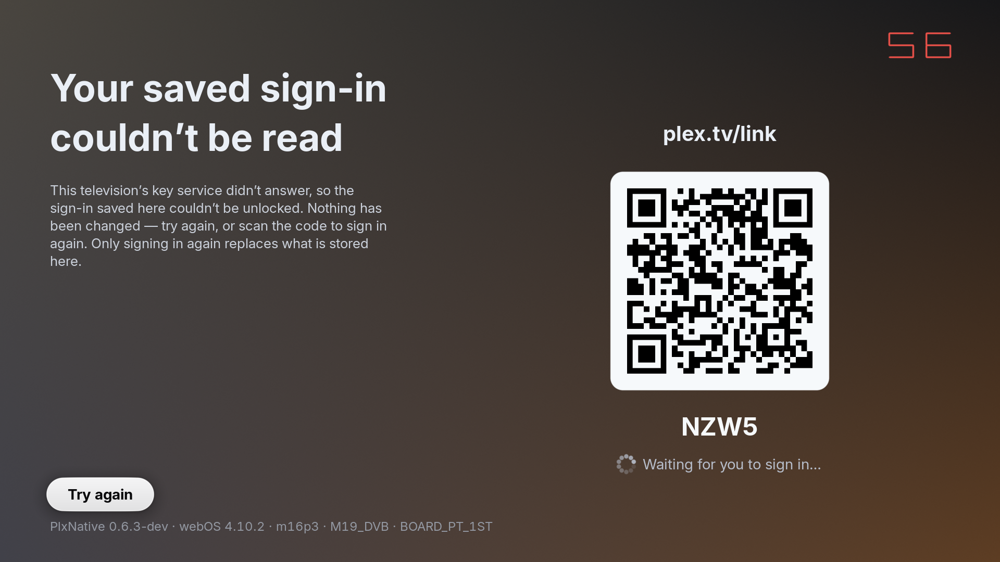

# The LS2 identity this app can get, measured on the dev television

**Measured 2026-09-10 on the dev set — LG 49SM9000PLA, `webOS TV release=4.10.2
codename=goldilocks2-grampians api=4.1.0 major=4`, `model=m16p3 board=M19_DVB`, `libAcbAPI`
present, keymanager3 ABSENT.** `FLAVOR=debug` (`com.beb.plxnative.debug`) throughout; panel off,
no media played, no stable install touched. Branch `consent/scope-versions-v0.6` at `2ebe4e70`,
binary `features=dev`, `PLX_VERSION` `0.6.3-dev`.

This settles issue #76's identity question for a webOS 4 set: **the app cannot register under its
own app id on this firmware, the keymanager identity it takes is `anonymous`, and taking that
decision does not disturb ACB.**

## 1. The three answers

| Question | Answer on this set |
|---|---|
| Which video-plane path, i.e. does `libAcbAPI` exist? | **ACB.** `vplane: ACB (webOS 4.x)`, `acb_holds_app_id=true` |
| Can the hub grant this executable the `<app id>` bus name? | **No — and not for the reason expected.** `LSRegisterApplicationService` is refused **`-1027` (invalid permissions)** with *either* name, at BOOT, before ACB has taken anything. Only plain `LSRegister(NULL)` registers. |
| Which identity does `keymanager` settle on? | **`identity=anonymous (libAcbAPI holds the app id on this firmware)`.** `identity=app_id` never appears. |

And the fourth, the one the gate exists for: **ACB still initializes.** `acb create=1` in every
run, including the two in which the probe registered on the LS2 bus first.

## 2. Run 1 — `plxnative-ls2identity` armed, install in its as-found state

```
make FLAVOR=debug deploy
ssh root@$TV ": > $(make -s print-rundir FLAVOR=debug)/plxnative-ls2identity"
make FLAVOR=debug run RUN_SECS=30
```

```
install: id=com.beb.plxnative.debug flavour=debug runtime=/tmp/com.beb.plxnative.debug features=dev APPID_env=com.beb.plxnative.debug
webos: webOS TV release=4.10.2 codename=goldilocks2-grampians api=4.1.0 major=4
webos: model=m16p3 board=M19_DVB hw=BOARD_PT_1ST
vplane: ACB (webOS 4.x)
ls2probe: acb_holds_app_id=true — the keymanager identity this firmware would take is anonymous
ls2probe: app-service name=appid: register REFUSED — code -1027: Invalid permissions for com.beb.plxnative.debug
ls2probe: app-service name=NULL: register REFUSED — code -1027: Invalid permissions for (null)
ls2probe: plain LSRegister name=NULL: registered
ls2probe: plain LSRegister name=NULL: getForegroundAppInfo → {"appId":"com.webos.app.livetv","returnValue":true,"windowId":"","processId":""}
...
keymanager: begin(decrypt) refused errorCode=-1
session: secure file is present but its device key is unavailable
storage report: stage=begin_decrypt class=secure_refused outcome=sent
boot: no session — starting QR sign-in
acb create=1
```

`APPID_env=com.beb.plxnative.debug` — SAM *does* export `APPID` to a native app on this firmware.

### 2.1 The deviation: `-1027`, not `registered` and not `-1028`

The recipe expected `ls2probe: app-service name=appid: registered`, on the reasoning that ACB has
not yet taken the name at boot, and named `-1028` as the interesting alternative. Neither happened.
The hub answers **`-1027` — "Invalid permissions"** — to `LSRegisterApplicationService` for *both*
names, and it does so **before `player::acb_init` runs** (the probe is called ahead of
`plex::session::load`; `acb create=1` appears 29 lines later in the same log). At that instant the
app id is free, so this is a permissions verdict and not a name-taken one.

That is not what the role file appinstalld generated for this install says. Read off the set,
`/var/palm/ls2-dev/roles/{prv,pub}/com.beb.plxnative.debug.json` are byte-identical and grant:

```json
"role": {
  "exeName":"/media/developer/apps/usr/palm/applications/com.beb.plxnative.debug/plxnative",
  "type": "regular",
  "allowedNames": ["com.webos.media.client.*","com.webos.rm.client.*","com.webos.pipeline.*","com.beb.plxnative.debug",""]
},
"permissions": [ … { "service":"com.beb.plxnative.debug", "outbound":["*"], "inbound":[] } ]
```

`com.beb.plxnative.debug` and `""` are both in `allowedNames`, and the app id has `outbound: ["*"]`.
Plain `LSRegister(NULL)` takes `""` from that list and works — the `getForegroundAppInfo` reply
above is a completed outbound call. So the refusal tracks the **registration API**, not the name:
on this firmware `LSRegisterApplicationService` is refused for a `type: "regular"` dev-mode role
whatever name it is handed, while `LSRegister` is granted. `-1027` for `name=NULL` — a shape that
asks for no name at all — is the clearest statement of that: there is no name for the hub to have
found taken.

**This corrected an existing repo claim** (`keymanager.rs`'s module doc and
`webos::ls2`'s carry the corrected story since branch `ls2/named-plain-registration`; §8b).
`resolve_registration`'s doc recorded `LSRegisterApplicationService(app_id, app_id) → -1028` on
this set as though ACB were the explanation. That measurement was taken
through the `gohome=probe` leg, which fires on a root BACK press — *after* `acb_init`. Both
readings are real and they are of different moments; what they agree on is that **this app never
obtains the app-id name on webOS 4.10**, which is all the identity decision depends on. The
`-1027` reading is the stronger one, because it removes ACB as the explanation.

### 2.2 Why no `keymanager: identity=` line appeared in run 1

Expected, and it is a property of *this install's stored state*, not of the change. The
`keymanager: identity=` line is emitted by `resolve_registration`, which is only reached through
`platform::Client::new(None)` — the SEAL side. The open side passes `Some(identity)` read off the
envelope and never asks. On this install:

```
/media/developer/com.beb.plxnative.debug-secure-storage.refused   {"reason":"envelope_unopenable","refused_at_version":"0.6.3-dev","stage":"begin_decrypt"}
/media/developer/com.beb.plxnative.debug-secure-storage.proven    {"proven_at_version":"0.6.3-dev","stage":"probe_opened"}
/media/developer/com.beb.plxnative.debug-auth.json                a keymanager3-sealed envelope, 4399 bytes
```

`has_refused_marker()` is therefore true, `seal_permitted` is false, `plant_probe` returns before
`ensure_identity()`, and the locked envelope makes `session::load` skip its own save
(`if !locked { save_locked(&s) }`). No save, no seal side, no identity line — the app went straight
to QR sign-in.

The recipe's fallback (drop the trigger, pick a profile in the who's-watching picker to force a
save) does not apply either: there is no readable stored session to boot into a picker from.

## 3. Run 2 — the same probe, over a fresh storage state

To reach the seal side, the three files above were **moved aside** (not deleted) and the run
repeated with the trigger still armed. That is exactly the state a first install on this firmware
is in, so the path taken is the production one.

```
vplane: ACB (webOS 4.x)
ls2probe: acb_holds_app_id=true — the keymanager identity this firmware would take is anonymous
ls2probe: app-service name=appid: register REFUSED — code -1027: Invalid permissions for com.beb.plxnative.debug
ls2probe: app-service name=NULL: register REFUSED — code -1027: Invalid permissions for (null)
ls2probe: plain LSRegister name=NULL: registered
ls2probe: plain LSRegister name=NULL: getForegroundAppInfo → {"appId":"com.webos.app.livetv","returnValue":true,"windowId":"","processId":""}
...
keymanager: identity=anonymous (libAcbAPI holds the app id on this firmware)
keymanager: keymanager3 is not on this firmware; using the 0600 file
session protection: no usable key manager; using the 0600 file fallback
session: secure storage has not yet been proven on this install; keeping the 0600 file and probing
boot: no session — starting QR sign-in
ptype=10
acb create=1
```

The identity line is verbatim what the change promises, and the reason it gives is the ACB fact
rather than the hub's answer — which is the point: the hub was asked nothing here.
`ensure_identity()` reached `resolve_registration`, `acb_holds_app_id()` was true, and the decision
short-circuited to anonymous **without** attempting the app-service registration at all. The
`-1027` the probe measured is what that short-circuit is standing in front of.

The 0600 fallback then wrote a 456-byte plaintext `auth.json` (mode `0600`, uid 6085) holding
nothing but a freshly minted `client_id`. No probe file and no marker was written — `seal` returns
`None` before there is anything to plant.

## 4. Run 3 — no probe trigger, plain launch

```
ssh root@$TV "rm -f $(make -s print-rundir FLAVOR=debug)/plxnative-ls2identity"
make FLAVOR=debug run RUN_SECS=20
```

```
net: bound libcurl -> libcurl.so.5 (libcurl/7.53.1 OpenSSL/1.0.2p zlib/1.2.11 c-ares/1.12.0 nghttp2/1.26.0; AsynchDNS=yes); threaded-tls=true legacy-locks=Installed
vplane: ACB (webOS 4.x)
keymanager: identity=anonymous (libAcbAPI holds the app id on this firmware)
keymanager: keymanager3 is not on this firmware; using the 0600 file
session protection: no usable key manager; using the 0600 file fallback
session: secure storage has not yet been proven on this install; keeping the 0600 file and probing
boot: no session — starting QR sign-in
ptype=10
acb create=1
```

`grep -c ls2probe` is **0** — the probe is trigger-gated as designed and costs an ordinary boot
nothing. The identity line is byte-identical to run 2's.

One ordering detail worth carrying: without the trigger, `vplane:` appears *later* in the log (line
28 rather than line 9) because `vp_mode()` is first evaluated by the identity decision itself.
`vplane:` is not a boot-order landmark; it is wherever something first asks.

## 5. `identity=app_id` on this set: absent, in all three runs

```
$ grep -c "identity=app_id" run1-probe-armed.log run2-fresh-probe-armed.log run3-plain.log
0 0 0
```

## 6. ACB was not disturbed

`acb create=1` in all three runs — `acb_create` returned non-zero, `ACB_OK` true. Runs 1 and 2 had
the LS2 probe register (and complete an outbound `getForegroundAppInfo`) on the bus *before*
`player::acb_init`, and ACB still initialized. No ACB registration failure appears in any log. This
is the check the gate exists to pass: the app does not take a name ACB needs.

Note the limit — this proves ACB *initialized*, not that a picture reaches the video plane. No
media was played (device etiquette for this session), so frame delivery is out of scope here and
remains covered by the ordinary playback tiers.

## 7. What was changed on the television, and what was put back

* The three storage files in §2.2 were copied, then renamed aside, then renamed back. Restored
  `auth.json` md5 `a88e991ba17803216fe3716527e5f20b`, identical to the copy taken before the
  session; size, mode and ownership unchanged (`4399`, `0600`, uid 6085). Both markers restored
  byte-for-byte. Re-verified after the interactive relaunch.
* The plaintext `auth.json` runs 2 and 3 wrote was deleted before the restore. No probe file or
  marker was created at any point.
* `plxnative-ls2identity` removed; `tools/tv-session.sh down` cleared the runtime root and
  relaunched a genuine interactive session. The TV lock was held for the whole session and
  released.
* The panel was **already off** when the session started and was left off — no change to restore.

## 8. Deviations from the recipe, collected

1. **`ls2probe: app-service name=appid` answered `-1027`, not `registered` and not `-1028`.** §2.1.
   The open question the recipe posed is answered in a third way: the app-service registration
   shape is refused on permissions grounds regardless of the name, before ACB exists to hold one.
2. **No `keymanager: identity=` line in run 1**, and the recipe's picker fallback was unusable.
   §2.2. Reaching the seal side needed the install's refused marker and locked envelope moved
   aside; §3 is that run, and it is the ordinary first-install path.
3. **Sound-off could not be asserted through luna.** `com.webos.service.audio/getStatus` and
   `/master/getVolume` both answer `Unknown method` on this firmware, matching the standing note
   that there is no luna mute tooling here. No media was played in any run, so the app produced no
   audio; the panel was off throughout.
4. The set was found with the debug install already running and the panel already off; it was
   handed back in the same shape.

## 8b. What the deviation changed in the app

`-1027` for `name=NULL` is the load-bearing reading: a shape that asks for no name cannot be
refused for a name being taken, so on this firmware the verdict is about
`LSRegisterApplicationService` as an API and not about the app id. The role file grants
`LSRegister` — `LSRegister(NULL)` registered and completed an outbound call in every run — and it
lists the app id in `allowedNames`. **The obvious third shape had therefore never been asked:
`LSRegister(app_id)`, a plain NAMED registration, which is exactly what those `allowedNames`
should permit and which gives the hub a sender service name, the second key of LG's key-manager
ownership rule (application id > sender service name).**

Since branch `ls2/named-plain-registration` (2026-09-10) it is asked:

* `keymanager::resolve_registration` prefers **application-service → plain named → anonymous**,
  and the identity vocabulary gains `named` on every surface that records one (the envelope, the
  probe file, the proven marker, the `keymanager: identity=` line, the storage report's new
  `registered_with_name` bool beside the unchanged `registered_with_app_id`).
* **The ACB gate covers both named shapes**, since `LSRegister(app_id)` asks for the very bus name
  `AcbAPI_initialize` takes. On this set nothing changes: the short-circuit still fires and the
  hub is still asked nothing, so §3's `identity=anonymous` line and §6's `acb create=1` stand.
* `webos::ls2::probe` grows the shape that was missing: `plain LSRegister name=appid`, logged and
  followed by a `getForegroundAppInfo` through the handle exactly as the others are.
  **`LSRegisterPubPriv` was considered and rejected**, on four counts: the NDK sysroot's
  `lunaservice.h` does not declare it; `tools/fwcompat.py --lib libluna-service2.so.3 --grep
  LSRegister` finds it absent from **11.2.0** (dropped with `LSRegisterPalmService`), so it can
  never be linked and `dlsym` would answer "absent" on the newest gated set; webOS OSE has REMOVED
  the declaration upstream, leaving only the macro `LS_DEPRECATED_PUBPRIV` ("No public/private bus
  any more"), so its signature is unciteable from any primary source and writing it from
  recollection is what `bind-tv-lib-abi` exists to forbid; and with no pub/priv split left in the
  hub both halves reduce to the `LSRegister(app_id)` the probe now performs directly.

**The probe half of that IS verified on a television now — §10.2.** The hub grants
`LSRegister(app_id)` on this set and ACB still initializes afterwards, so the shape the role file
always allowed is real rather than assumed. What stays unverified is the shape being *used*: the
ACB gate short-circuits before `keymanager` asks, so `Identity::Named` has still never sealed
anything on any set. §9's first bullet is still the measurement that matters, and it now has a
second question attached to it.

## 9. What this does NOT settle

* **Every reading is webOS 4.10.2.** The measurement issue #76 actually needs is the same probe on
  a 2024+ set where `libAcbAPI` does not exist — there `acb_holds_app_id` is false, the
  short-circuit does not fire, and the hub's answer to `LSRegisterApplicationService` becomes the
  decision. Nothing here predicts it: this set's `-1027` is a verdict from a webOS 4 hub on a
  webOS 4 dev-mode role file.
* **Whether a differently-shaped role file would be granted the app-service registration** is
  untested. The role file here is the one appinstalld generates; `type: "regular"` was not varied.
* **keymanager3 is absent on this set**, so nothing in §§1-8 grades a *working* key manager's
  behaviour under either identity. §10.4 reaches the app's half of that with the dev-only fake
  service (`plxnative-keymanager=healthy|stall`) — seal, promote, stall, report, retry, all on this
  television — but a fake is not LG's implementation, and §10.6 says what that still leaves open.

## 10. Runs 4-6, the named shape and a stalled service

**Second session, same evening, same set** — `FLAVOR=debug`, panel off, no media played, the stable
install untouched, one TV lock held for the whole session and released at the end. Branch
`consent/scope-versions-v0.6` at `8302cf8b`, binary `features=dev`, `PLX_VERSION` `0.6.3-dev`,
build id `3511c31436bd4f68f76963b425c6e99d2a643b0a`.

It answers the two questions §8b and §9 left open on this firmware — **does the hub grant
`LSRegister(app_id)`, and what does the app do when a key service that HAS sealed something stops
answering** — and it closes the "untested on any television" note that shipped beside shape 2.

### 10.1 The answers

| Question | Answer on this set |
|---|---|
| Does the hub grant the plain NAMED shape, `LSRegister(app_id)`? | **Yes.** `ls2probe: plain LSRegister name=appid: registered`, followed by a completed outbound `getForegroundAppInfo`. The role file's `allowedNames` means what it says. |
| Does taking that name disturb ACB? | **No.** `grep -c "acb create=1"` is **1** in the same log — the probe registers the app id and releases it before `player::acb_init`. |
| Which identity does `keymanager` settle on? | **`anonymous`, unchanged.** The ACB gate short-circuits BOTH named shapes, so the hub is never asked on webOS 4 — exactly as designed. |
| Does a stalled key service cost the install its sealed sign-in? | **No.** The envelope is byte-identical across the stalled launch, no refused marker is written, the launch is counted once, and the sign-in screen draws the *Try again* read-out. |

### 10.2 Run 4 — boot probe, install in its as-found state

```
make FLAVOR=debug deploy
ssh root@$TV ": > $(make -s print-rundir FLAVOR=debug)/plxnative-ls2identity"
make FLAVOR=debug run RUN_SECS=30
```

```
install: id=com.beb.plxnative.debug flavour=debug runtime=/tmp/com.beb.plxnative.debug features=dev APPID_env=com.beb.plxnative.debug
webos: webOS TV release=4.10.2 codename=goldilocks2-grampians api=4.1.0 major=4
webos: model=m16p3 board=M19_DVB hw=BOARD_PT_1ST
vplane: ACB (webOS 4.x)
ls2probe: acb_holds_app_id=true — the keymanager identity this firmware would take is anonymous
ls2probe: app-service name=appid: register REFUSED — code -1027: Invalid permissions for com.beb.plxnative.debug
ls2probe: app-service name=NULL: register REFUSED — code -1027: Invalid permissions for (null)
ls2probe: plain LSRegister name=appid: registered
ls2probe: plain LSRegister name=appid: getForegroundAppInfo → {"appId":"com.webos.app.livetv","returnValue":true,"windowId":"","processId":""}
ls2probe: plain LSRegister name=NULL: registered
ls2probe: plain LSRegister name=NULL: getForegroundAppInfo → {"appId":"com.webos.app.livetv","returnValue":true,"windowId":"","processId":""}
...
session: secure storage is marked refused on this install; keeping the 0600 file
boot: stored session — local server (offline-capable)
acb create=1
```

**Answer (a): `registered`, with a reply.** Probe lines 1-3 and 5-6 are byte-identical to §2's run 1,
so the two sessions agree on everything that had already been measured; lines 4 and 5 are the new
shape and they are the finding. `grep -c "acb create=1"` is **1**, and the ACB line is 30 lines below
the probe — the probe took the app id as a bus name, completed a call under it, released it, and ACB
still initialized afterwards. That is the gate's whole premise observed rather than assumed, and it
is what makes shape 2 a real candidate on a firmware where the app-service form is refused outright.

Note what it does NOT license. This proves the hub GRANTS the name to a probe that asks early; it
does not prove the name would be free at the moment `keymanager` asks on a set where ACB wants it,
and on this firmware the module never asks at all. `resolve_registration`'s ACB gate stands.

### 10.3 Run 5 — seal side over a fresh storage state

Trigger removed, and the install's `auth.json` plus its `secure-storage.refused` and
`secure-storage.proven` markers moved aside per §7 (there was no probe file and no unavailable
marker to move).

```
vplane: ACB (webOS 4.x)
keymanager: identity=anonymous (libAcbAPI holds the app id on this firmware)
keymanager: keymanager3 is not on this firmware; using the 0600 file
session protection: no usable key manager; using the 0600 file fallback
session: secure storage has not yet been proven on this install; keeping the 0600 file and probing
boot: no session — starting QR sign-in
acb create=1
```

Byte-identical to §3/§4's identity line, and `grep -c ls2probe` is 0. A 456-byte plaintext
`auth.json` (mode `0600`, uid 6085) holding a freshly minted `client_id` was written, and — the
service being genuinely absent — no probe and no marker, exactly as §3 recorded.

### 10.4 Run 6 — the stalled-service read-out, on hardware

The point of this run is that the previous three sessions could only ever watch this firmware's
*missing* key service. `plxnative-keymanager=<mode>` (`rust-modules/src/keymanager.rs`'s `fake`
module) supplies one, so the failure the read-out exists for can be produced on a television that
has no keymanager3 at all. Three launches, storage files still aside:

**6a, `mode=healthy`** — a service that works. The save falls back to plaintext because the install
is not yet proven, and plants the cross-launch probe:

```
keymanager: FAKE service armed mode=healthy
keymanager: generateKey -> created
session protection: keymanager3
session: secure storage has not yet been proven on this install; keeping the 0600 file and probing
```

`<id>-secure-probe.json`, 233 bytes: `{"backend":"keymanager3","key":"plxnative.session.v1","iv":"…","data":"…","identity":"anonymous","attempts":0,"key_outcome":"created"}`.

**6b, `mode=healthy` again** — the probe opens, the install is promoted, and the session is sealed
for real:

```
keymanager: FAKE service armed mode=healthy
keymanager: generateKey -> created
session protection: keymanager3
```

`<id>-secure-storage.proven` — `{"identity":"anonymous","proven_at_version":"0.6.3-dev","stage":"probe_opened"}` —
and `<id>-auth.json` is now an 836-byte `{"format":"plxnative-secure-session","version":1,"sealed":{"backend":"keymanager3",…}}`
envelope, md5 **`ad607196a7798e42d7c0000b8e71be44`**. The probe file is consumed.

**6c, `mode=stall`** — the same install, the same envelope, a service that answers nothing:

```
keymanager: FAKE service armed mode=stall
session: secure file is present but its device key is unavailable
session: the key service did not answer this launch; the sealed sign-in is left untouched
storage report: stage=no_reply class=secure_unavailable outcome=sent
boot: no session — starting QR sign-in
telemetry: flushed 3 of 3 record(s)
```

Every one of the five things this state is supposed to guarantee, checked on disk while the app was
still up:

| Check | Result |
|---|---|
| envelope untouched | md5 `ad607196a7798e42d7c0000b8e71be44` before AND after — byte-identical |
| refused marker | **absent** (`ls` says No such file); the report's own `refused_marker` is `false` |
| unavailable counter | `{"launches":1,"noted_at_version":"0.6.3-dev","stage":"no_reply"}` |
| storage report | `stage=no_reply class=secure_unavailable outcome=sent`, and `flushed 3 of 3` |
| the screen | the read-out below |



Panel capture (`tools/tv-session.sh shot`, `DISPLAY` source, 1920x1080), panel turned on for the
capture alone and off again after. The read-out is *Your saved sign-in couldn't be read* with the
*Try again* pill focused, the QR stack live beside it, and the diagnostics footer naming the build
and the set. The pairing code visible in it is a transient plex.tv link code, expired long before
this file was committed.

**The Sentry side.** The report arrived in `plx-native-dev` (org `gleb-linnik`, region
`https://de.sentry.io`) as **`StorageError: no_reply`**, issue `PLX-NATIVE-DEV-8`, event
**`72b056726c19b02b1f83e81c368b4306`**, `2026-09-10T20:59:16Z`:

```
release        plxnative@0.6.3-dev        environment  development
dist           3511c31436bd4f68f76963b425c6e99d2a643b0a
storage.stage  no_reply                   storage.class  secure_unavailable
storage        { class: "secure_unavailable", stage: "no_reply", refused_marker: false,
                 sealed_identity: "anonymous",
                 registered_with_app_id: false, registered_with_name: false }
user           id:<this install's errors_id>
```

`sealed_identity: "anonymous"` is the envelope's own record and `registered_with_*` are both `false`
— the two facts the report exists to settle for a reporter's set, arriving correctly from a real
television. `refused_marker: false` is the same statement the disk makes: a stalled service teaches
this install nothing.

**Try again**, pressed through the remote FIFO on the running app (`okdown`, 1 s, `okup` — the split
halves, because the pill's press arms on the key-down and commits on the up):

```
keymanager: retry -> no_reply
```

Exactly once, and the four disk facts above were re-checked after it and were all unchanged —
envelope md5 identical, no refused marker, `launches` still 1. A press against a service that is
still silent costs the stored sign-in nothing, which is the promise the read-out's copy makes.

### 10.5 Deviations from the recipe, collected

1. **Run 4 emitted NO `keymanager: identity=` line at all**, so the instruction that it "must read
   `anonymous` in every run" cannot be met literally. Same cause as §2.2: the as-found install
   carries a refused marker, `seal_permitted` is false, and the seal side — the only caller of
   `resolve_registration` — is never reached. Where the line IS emitted it reads `anonymous`
   (run 5, byte-identical to §3), and `identity=app_id` and `identity=named` are absent from all
   three of this session's non-fake runs.
2. **A `plxnative-keymanager=<mode>` run emits no identity line either, by construction.** The fake
   bypasses LS2 entirely — `platform::Client::new`'s fake arm returns `required.or_else(identity)
   .unwrap_or_default()` without registering — so runs 6a-6c cannot log one. The identity is still
   recorded where it matters: `"identity": "anonymous"` in the probe file, in the proven marker and
   in the Sentry report's `sealed_identity`. Anything reading these runs for an identity line will
   find nothing and must read those three instead.
3. **The files were restored after run 6, not after run 5.** Run 6 needs the same aside state, so a
   restore between them would have undone it. All four were restored at the end and re-verified.
4. **The panel does not stay off across a launch.** It was turned off at the start of the session,
   but SAM's relaunch reactivates it — `screen on` before the capture answered `-102 "The current
   state must be 'Screen Off'"`, i.e. it was already Active. Re-asserted off at the end and
   confirmed. A session that needs the panel dark throughout has to re-assert after every launch,
   not once at the start.
5. **`plxnative-crash.log` was deleted by an over-broad trigger clear and put back from the running
   process's own file descriptor** (`cat /proc/<pid>/fd/6` — the app still held the unlinked inode),
   2064 bytes recovered intact and prepended to the session's log. That restore has a visible side
   effect worth stating rather than hiding: prepending bytes moves every offset past the telemetry
   crash mark, so the next healthy boot re-imported a fault record already reported by the Sentry
   Native daemon, and `plx-native-dev` now holds ONE duplicate of this session's own libmali
   SIGSEGV (`PLX-NATIVE-DEV-6` from the daemon, `PLX-NATIVE-DEV-7` from the re-read local record).
   The general rule: `rm -f <rundir>/plxnative-[a-z]*` also matches the three logs and the FIFO;
   clear triggers by name, or use `tools/tv-session.sh up`, which knows the difference.
6. **The handback boot rewrote `auth.json`.** Restored byte-identical (md5
   `f28f74bac49566138bea9e5b3283eba7`, matching the copy taken before the session), then
   `tools/tv-session.sh down`'s interactive relaunch saved it again. A structural diff of the two
   shows exactly one changed leaf, `home_users[0].thumb` — an avatar URL plex.tv rotates — with
   every other field, the size, the mode and the ownership unchanged. Nothing of the household's
   was lost; run 4 had loaded the same file without rewriting it, which is why this was checked
   rather than assumed.
7. **Sentry's search index lagged about six minutes.** `storage.stage:no_reply` returned nothing on
   two queries after the app had already logged `outcome=sent` and `flushed 3 of 3`. It is a search
   lag, not a delivery failure — do not read an empty result inside the first ten minutes as a
   report that never arrived.

### 10.6 What runs 4-6 still do NOT settle

* **The named shape is granted but has never been USED to seal anything.** Nothing here makes
  `keymanager` take it: the ACB gate short-circuits first on this firmware, so `Identity::Named`
  remains a path no television has executed end to end. What run 4 removes is the possibility that
  the hub would simply refuse it.
* **Run 6 graded the app against a FAKE service, not against keymanager3.** It proves the app's
  own behaviour — the state machine, the counter, the report, the screen, the retry — over a
  correctly-shaped stall. It proves nothing about how LG's real service behaves on a set that has
  one, which is still the measurement issue #76 needs from a 2024+ television.
* **A stall is not the escalation.** `UNAVAILABLE_MAX_LAUNCHES` was not reached: one launch was
  counted, and what the install does after the allowance runs out was not exercised on hardware.
